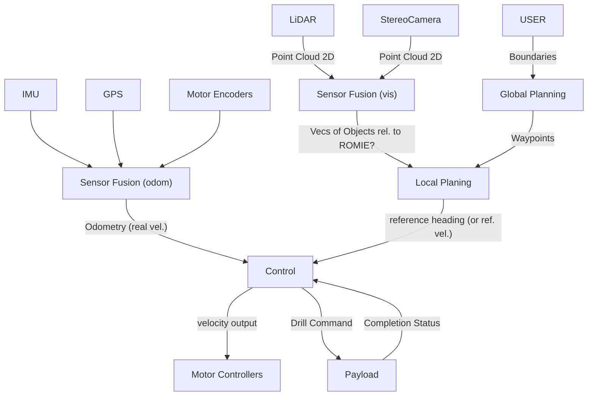

# Prospector Robotics - ROMIE Global Path Planning Software and Control Interface
A University of Bath Integrated Mechanical and Electrical Engineering 3rd Year Project.


Here is the story of the project: [Link to PDF](./PRltdCommercialViability.pdf)

The Global Path Planning is a sub-system of the overal architecture of ROMIE. The Global Path Planning is responsible for taking the user's input and generating a path for ROMIE to follow. The path is generated by using a combination of the user's input and the data from the sensors on ROMIE. The path is then sent to the Local Path Planning sub-system. A diagram of the overall architecture can be seen below.


# Web Interface
This website is meant to be a platform where the mining engineer can choose and generate the sampling points that ROMIE is going to visit. It using Google Maps API to visualise the potential prospecting land. He/She can generate the best path and see on the map the path.

This website is also used at the moment as a playground to test the effect of different Traveling Salesman Problem algorithms. The algorithms are implemented in Python and the results are displayed on the website. The algorithms are also used to generate the path for ROMIE to follow.

# Travelling-Postman-Problems-Algorithms

This repository contains a series of different TSP algorithms based on Google OR-Tools, Genetic Algorithms and Machine Learning Reinforcement Learning: Q-learning. 

# Details to run TSPP app
Go into the TSPP/myapp directory and run
```bash
python3 manage.py runserver 8080
```

# This is the user experience guide


# This is the django software architecture


# This is a snippet video of the user interface


